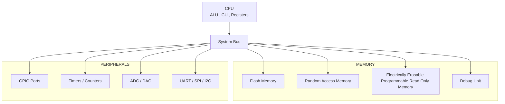

## Microcontroller
A microcontroller (MCU) is a compact, cost-effective, "computer on a chip" designed to manage specific, dedicated tasks within embedded systems, such as in appliances, automobiles or robots. It integrates a processor core (CPU), memory (RAM/ROM), and programmable input/output (I/O) peripherals on a single integrated circuit.


### What an MCU contains
```
An MCU combines several components in one chip:
1. CPU (Processor)
    Executes instructions
2. Memory
    * Flash -> stores program/code
    * RAM -> temporary data storage
    * EEPROM -> stores small permanent data
3. Input/Output Pins (GPIO)
    Used to connect sensors,LEDs,motors etc
4. Timers
5. Communication Interfaces
    * UART
    * SPI
    * I2C
6. Analog Peripherals
    * ADC (Analog-to-Digital Converter)
    * DAC (Digital-to-Analog Converter)
```


### Types of Microcontrollers
Classified in different ways depending on number of bits, memory architecture, instruction set and memory type

### Classification based on number of bits
```
1. 8 bits
An 8-bit MCU processes 8 bits of data at a time
   - Characteristics
     - Low cost
     - Simple architecture
     - Low power consumption
     - Limited memory and speed

   - Internal Operation
     - ALU operates on 8-bit registers
     - Data Bus = 8 bits
     - Instruction size is usually small


2. 16 bits
An 16-bit MCU processes 16 bits of data at a time
   - Characteristics
     - Higher speed than 8 bit
     - Large memory addressing 
     - Better arithmetic operations

   - Internal Operation
     - 16 bit ALU
     - 16 bit data bus
     - Large registers

3. 32 bits
An 32-bit MCU processes 32 bits of data at a time
   - Characteristics
     - Very high processing speed
     - Large memory support
     - Advanced peripherals
     - Suitable for complex algorithms

   - Internal Operation
     - 32 bit cpu
     - Large RAM and flash
     - DSP instructions
```

### Classification based on Memory Architecture
```
1. Harvard Architecture
   - Program memory and data memory are separate
   - It uses 2 separate buses
     - Instruction bus - fetch program 
     - Data bus - read/write data 
   - Faster execution
   - More complex
   - Cost is high

2. Von Neuman Architecture
   - Program and data share the same memory
   - It uses single bus
     - single memory stores both program and data
   - Slower execution
   - Less complex
   - Cost is low
```

### Classification based on Instruction set
```
1. RISC (Reduced Instruction Set Computer)
   - Small instruction set 
   - Faster Performance
   - One instruction per clock cycle
   - Simple instructions

2. CISC (Complex Instruction Set Computer)
   - Large instruction set
   - Slower Performance
   - Multiple instructions per clock cycle
   - Complex instructions
```
   
### Classification based on Memory Type
```
1. Embedded Memory Microcontrollers
   - Memory is inside the chip
   - Types of memory - ROM,Flash and EEPROM

2. External Memory Microcontrollers
   - Memory is connected externally
   - Large Memory capacity
```

### Parts of Microcontroller
1. CPU (Central Processing Unit)
```
The CPU is the brain of the Microcontroller
It executes the program instructions

Main Components inside the CPU
- ALU (Arithmetic Logic Unit)
Performs mathematical and logical operations

Operations include:
- Addition
- Substraction
- AND
- NOT
- OR
```

2. Control Unit (CU)
```
The control unit manages the flow of data inside the MCU
- Fetch instructions from memory
- Decode instructions
- Send control signals to peripherals
- Coordinate CPU operations
```

3. Registers
```
Registers are very small high-speed memory locations inside the CPU
They store:
- Temporary data
- Addresses
- Instructions

Common registers:
Accumulator - stores arithmetic results
Program Counter - stores next instruction address
Stack Pointer - Manages stack memory
Status Register - stores flags
```

4. Memory
```
Memory stores both program instructions and data

- Flash Memory (Program Memory) :
Flash memory stores the program code
  - Non-volatile memory
  - Data remains even when power is OFF
  - Used to store firmware

- RAM (Random Access Memory) :
RAM stores temporary data during program execution
  - Volatile memory
  - Data is lost when power is OFF
  - Used for variables and calculations

- EEPROM :
EEPROM stores small permanent data
  - Non-volatile
  - Can be rewritten
  - Used for configuration values
```

5. Input/Output ports (GPIO) :
```
GPIO means General Purpose Input Output pins.
These pins connect the MCU to external devices.
- Read input signals
- Send output signals

Examples of devices connected:
LED
Motor
Sensor
```

6. Timers and Counters
```
Timers are used to measure time intervals
Counters count external events.
- Generate delays
- Measure time
- Control PWM signals
- Event counting
```

7. Interrupt System
```
Interrupts allow the MCU to respond immediately to important events
Instead of continuously checking events, the MCU pauses the current task and executes an interrupt routine
```

8. Communication Interfaces
```
Microcontrollers communicate with other devices using communication protocols

Common interfaces:
- UART
Used for serial communication between devices.
Example:
MCU ↔ Computer

- SPI (Serial Peripheral Interface)
High-speed communication between MCU and peripherals.
Example devices:
Sensors
Displays
Memory chips

- I²C (Inter-Integrated Circuit)
Used for communication between multiple ICs using only two wires.
Example:
Temperature sensors
RTC modules
```

9. ADC (Analog to Digital Converter)
```
ADC converts analog signals into digital values
Many sensors produce analog signals
```

10. DAC (Digital to Analog Converter)
```
DAC converts digital data into analog signals
DAC converts it into analog voltage
```

11. Clock System
```
The clock provides timing signals for the MCU
It determines how fast instructions execute
```

12. Bus System
```
Buses transfer data between components
Types:
Data Bus
- Transfers data.
Address Bus
- Carries memory addresses.
Control Bus
- Carries control signals.
```

### Uses of Microcontroller
```
1. Home Applainces
Microcontrollers control the functioning of many household devices
- Example:
 - Washing Machine
 - Microwave Ovens
 - Refrigerators
 - Air Conditioners

2. Automotive Systems
Modern vehicles contain many number of microcontrollers
- Example:
 - Engine control unit (ECU)
 - Airbag system
 - Anti-lock braking system (ABS)
 - Power steering
 - Cruise control

3. Industrial Automation
Microcontrollers are used to control machines in industries
- Example:
 - Robotics
 - Conveyor belt systems
 - Temperature control systems
 - Motor control

4. Medical Devices
Microcontrollers are used in healthcare equipment
- Example:
 - Heart rate monitors
 - Blood glucose meters
 - ECG machines
 - Digital thermometers

5. Internet of things (IoT)
IoT devices rely heavily on microcontrollers
- Example:
 - Smart homes
 - Smart cities
 - Wearable devices

6. Aerospace and Defence
Microcontrollers are used in advanced systems such as
 - Satellite communication
 - Flight control systems
They control sensors and navigation systems
```


### Architecture of Microcontroller
```
- CPU (Central Processing Unit)
- Memory (Flash, RAM, EEPROM)
- Input/Output Ports (GPIO)
- Timers and Counters
- Interrupt Controller
- Communication Interfaces
- ADC/DAC
- Clock System
- Bus System
- Debug Unit
```



## Pin Diagram of 8085 Microprocessor
```
- Pins 1 and 2
  Are responsible for the clock pulse or frequency of the microprocessor
- Pin 3 RESET OUT
  Is used to reset the peripherals connected to the microprocessor
- Pin 36 RESET IN
  It is an input pin
  It is an active low pin
  If we apply logic zero it will be activated
  It sets the program counter zero and clear the buses
- Pin 4 and 5
  Serial output data 
  Serial input  data
  The data transfer between the micoprocessors and the memory and I/O devices can happen either in serially or parallely 
- Pins 6 to 11 Interrupt pins
- Pin 6 TRAP
  It is non maskable interrupt,generated by external device,its vector addresss is 0024H
  It is used for critical situations like power failure,hardware malfunctioning
- Pin 7 to 9 RST 7.5,6.5,5.5 (Restart Interrupts)
  Maskable interrupts
  Generated by software instruction
  RST 7.5>RST 6.5>RST 5.5
  RST 7.5:7.5x8=003CH
  RST 6.5=6.5x8=0034H
  RST 5.5=5.5x8=002CH
- Pin 10 INTR (Interrupt Request)
  Maskable Interrupt,Generated by external devices like keyboard,mouse,lowest priority
- Pin 11 INTA (Interrupt Acknowledgement)
  Active low output pin,activated by logic zero
  Service to other interrupts
- Pins 12 to 19 Data Bus
  This are bidirectional pins
  Used for receiving the program code from memory
  Used for receiving a data byte from an input port or memory
  Used for sending a data byte to an output or memory 
- Pins 31 and 32
  WR stands for write
  RD stands for read
  Both are active low pins ,we need to send logic zero to activate these pins
  if WR is 0 and RD is 1 then AD(7-0) are output pins
  if WR is 1 and RD is 0 then AD(7-0) are input pins
  if WR is 1 and RD is 1 then some internal processing
  if WR is 0 and RD is 0 then microprocessor is malfunctioned
- Pins 20 and 40 
  Vss Ground
  Vcc +5v dc power supply
- Pins 28-21 and 19-12 comprise of address bus
  1 bit can address 2^1 locations
  2 bit can address 2^2 locations similarly 
  n bit can address 2^n locations
  16 bits can address 64K locations
  A(15-8) Higher order byte and AD(7-0) Lower order byte
- Pin 30 ALE
  Stands for Address Latch Enable
  ALE=1 Address Bus
  ALE=0 Data Bus
- Pin 34 Io/M
  IO/M   WR  RD   Function
  0      0   1    Microprocessor writes to memory
  0      1   0    Microprocessor reads from memory
  1      0   1    Microprocessor writes to output port
  1      1   0    Microprocessor reads from input port
- Pins 29 and 33:S1 and S0
  Status signals
  Indicate different phases of instruction cycle
  IO/M S1 S0 Machine Cycle
  0    1  1  Opcode Fetch (OF)
  0    1  0  Memory Read (MR)
  0    0  1  Memory Write (MW)
  1    1  0  I/O Read (IOR)
  1    0  1  I/O Write (IOW)
  1    1  1  Interrupt Acknowledge (INA)
- Pin 35 Ready
  Indicates whether an I/O device is ready to send/receive data
  Ready=1(High),I/O device is ready 
  Ready=0(Low),Microprocessor is waiting
- Pin 37 CLK(out)
  Provides timing reference for various components
- Pins 38 and 39 HLDA and Hold
  Direct Memory Access Signals
  HOld:External device requests Bus Access
  HLDA: Acknowledge the hold request
```

## Typical Structure of MPU
```
  Register Section
   1. Registers Accessible to Programmers
   - General Purpose Registers:(8-bit)
      B,C,D,E,H,L
   - Special Purpose Registers
      8 bit:Accumulator,Index Register,Status/Flag Register
      16 bit:Program Counter,Stack Pointer
   2. Registers Inaccessible to Programmers
      Memory Address Register(16 bit),Temporary Registers

- Interface Section
  1.Address Bus:Pins 28-21 and 19-12
  2.Data Bus:Pins 19-12
  3.Control Bus:
  - Memory and I/O control Lines:
    - RD and WR
    - IO/M
    - Ready
    - ALE
    - S0 and S1
  - CPU and Bus Control Lines:
    - RESET IN and RESET OUT
    - Interrupt Lines
    - Hold and HLDA
  - Utility Control Lines:
    - Vcc and Vss
    - X1,X2 and CLK(0ut)
```

## Importance of Registers in Micro processing unit(MPU)
```
  Register can store either data,address or instruction temporarily

- Status/Flags Register
  Components of the Flags Register
  7 6 5 4 3 2 1 0
  0:Cy-Carry
  1,3,5:x-Dont care
  2:P-Parity
  4:AC-Auxiliary Carry
  6:Z-Zero
  7:S-sign
  - Carry is set (cy=1)
    If the carry is generated from the Most Significant Hexadecimal Digits
  - Auxiliary Carry is set (AC=1)
    If the Carry is generated from the Least Signficant Hexadecimal Digits
  - Sign is set (s=1)
    If the Msb of the Accumulator is 1
  - Parity is set (P=1)
    If the number of 1's in the Accumulator is even 
  - Zero is set (Z=1)
    If the accumulator contans all 0's

- Stack POinter
  It is of 16 bits 
  It is used to point of the stack having the smallest location with the useful information
  It is used during function calls and used to store memory addresses
- Program Counter
  It is of 16 bits special purpose registers used to store memory addresses
```


##  Basic Interfacing Components of 8085 Microprocessor
```
  1. Latch
     A latch is a fundamental circuit used to store binary information
     Latch is used to hold the lower order address till either read or write operation is completed
     Ex:74LS373-8 latchesg

  2. Tristate buffer
     It is used for isolation when multiple devices are connected to a shared bus 
     It has three states:
     - Logic 0 (E:0)
     - Logic 1 (E:0)
     - High Impedance (Z) (E:1)

  3. Encoder
     Encoder is a device used to convert information from one format into another suitable for processing by the microprocessor
     Encoder is a logic device that converts one of the input signals into a coded output signal
     It can be used to reduce the number of lines in a digital circuit

  4. Decoder
     Decoder is a crucial component used to select and activate specific peripheral devices or memory locations based on the address signals provided by the    microprocessor.It can be used to decoding of memory and I/O devices
``` 

## Data Transfer Instructions of 8085 Microprocessor
```
  1. MVI r,d8:Move Immediate,Load a register with an 8-bit value,2 byte long
  2. MOV r1,r2:Move,Load register r1 with the value in register r2,1 byte long
  3. MOV r,M:Load a register with the 8-bit value in memory location,Register indirect addressing,1 byte long
  4. MOV M,r:Load a memory location with the 8-bit value in register 'r',1 byte long
  5. LXI rp,d16:Load extended register Immediate,Load a register pair with an 16-bit value,Immediate addressing,3 byte long  
  6. MVI M,d8:Move Immediate,Load a memory location with an 8-bit value,2 byte long
  7. LDA a16:Load Accumulator contents from memory,3 byte long
  8. STA a16:Store Accumulator contents in Memory,3 byte long
  9. XCHG:exchange the contents of H-L pair with D-E pair,1 byte long
  10. LDAX rp
      Load Accumulator from memory pointed by extended register
      Register in-diresct addressing
  11. STAX rp
      Store Accumulator contents in memory pointed by extended register
      Register in-direct addressing 
  12. LHLD a16
      Load H-L pair using Direct addressing from memory location
      Absolute addressing,3 byte long
      Involves two consecutive locations
  13. SHLD a16
      Store H-L pair using Direct addressing in memory location
      Absolute addressing,3 byte long
      Involves two consecutive locations
```
 

## Arithmetic Instructions of 8085 Microprocessor
```
  1. ADD R
     ADD contents of R to accumulator
     The result of the addition will also be stored in the accumulator,1 byte long
  2. ADI d8
     ADD immediate to accumulator
     Immediate addressing,2 byte long
  3. INR R
     Increment the contents of R
     All flags,except Cy flag,are affected depending on the result,1 byte long
  4. ADC R
     Add with carry the contents of R to accumulator
     The result of the addition will also be stored in the accumulator,1 byte long
  5. ACI d8
     Add with carry immediate to accumulator
     Immediate addressing,2 byte long
  6. SUB R
     Subtract contents of R from accumulator
     The reult of the substraction is also stored in the accumulator,1 byte long
  7. SUI d8
     Subtract Immediate from accumulator
     Immediate addressing,2 byte long
  8. DCR R
     Decrement the contents of R
     All flags,except Cy flag,are affected depending on the result,1 byte long 
  9. SBB R
     Subtract with borrow contents of R from accumulator
     The result of the subtraction will also be stored in accumulator,1 byte long
 10. SBI d8
     Subtract with borrow immediate from accumulator
     Immediate addressing,2 byte long 
 11. INX rp
     Increment extended register,None of the flags are affected,1 byte long
 12. DCX rp
     Decrement extended register,None of the flags are affected,1 byte long
 13. DAD rp
     Double Add register pair with H-L pair
     No flag,except Cy flag,is affected depending on the result,1 byte long
 14. DAA
     Decimal Addition in 8085 Microprocessor
     - Binary Coded Decimal Numbers(BCD)
     DAA Instruction
     - Decimal Adjust Accumulator
     - Depends on the contents of accumulator,AC and Cy flags,1 byte long
       1. If LS Hex digit <= 9 and AC = 0
          the LS Hex digit wont be altered
       2. If LS Hex digit > 9 and AC = 1
          DAA instruction adds 6 to the LS Hex Digit
       3. If MS Hex Digit <= 9 and Cy=0
          the MS Hex digit wont be altered
       4. If MS Hex dgit > 9 or Cy=1
          DAA instruction adds 6 to the MS Hex digit 
```


## Logical Instructions of 8085 Microprocessor
```
  Provides operation for AND,OR,EXOR,NOT
  Doesn't provide operation for NAND,NOR
  1. ANA R
     AND Accumulator with R
     Cy is Reset(0) and AC is Set(1),remaining flags are affected based on the accumulator content,1 byte long
  2. ANI d8
     AND Immediate with accumulator
     Cy is Reset(0) and AC is Set(1),remaining flags are affected based on the accumulator content,2 byte long
  3. ORA R
     OR Accumulator with R
     Cy and AC are Reset(0),remaining flags are affected based on accumulator content,1 byte long
  4. ORI d8
     OR Immediate with accumulator
     Cy and AC are Reset(0),remaining flags are affected based on accumulator content,2 byte long
  5. XRA R
     exclusive OR Accumulator with R
     Both Cy and AC are Reset(0),remaining flags are affected based on the accumulator content,1 byte long
  6. XRI d8
     exclusive OR Immediate with accumulator
     Both Cy and AC are Reset(0),remaining flags are affected based on the accumulator content,2 byte long
  7. CMA
     Complement the accumulator,No flags are affected,1 byte long
  8. CMC
     Complement the carry flag,1 byte long
  9. STC 
     Set the carry flag ,1 byte long
 10. CMP R
     Compare accumulator with R
     Flags are affected based on the Temporary Registers content,1 byte long
 11. CPI d8
     Compare Immediate with accumulator
     Flags are affected on the temporary registers content,2 byte long 
 12. RLC
     Rotate left accumulator and send a copy to cy flag,1 byte long
 13. RAL
     Rotate accumulator left involving the Cy flag,1 byte long
 14. RRC
     Rotate right accumulator and send a copy to cy flag,1 byte long
 15. RAR
     Rotate accumulator right involving the cy flag,1 byte long 
```


## Addressing Modes of 8085 Microprocessor
```
Different ways of accessing the data is called Addressing Modes

- Different Addressing Modes of 8085 Microprocessor
  1. Immediate Addressing Mode
     MVI A,12H
  2. Register Addressing Mode
     MOV A,B
  3. Absolute Addressing Mode (Direct Addressing Mode)
     LDA F820H,STA,LHLD,SHLD
  4. Register Indirect Addressing Mode
     MOV A,M,LDAX rp,STAX rp
  5. Implied Addressing Mode
     XCHG
```


   

    
   


      
      
      


