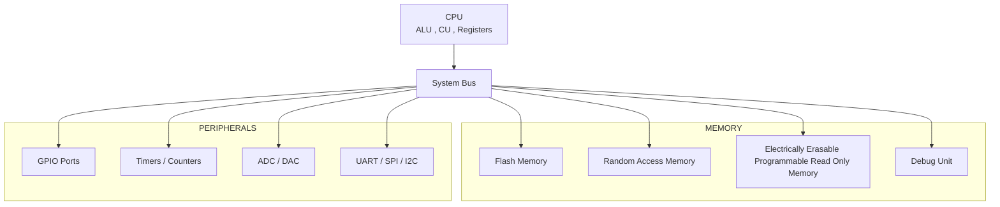

## Microcontroller
A microcontroller (MCU) is a compact, cost-effective, "computer on a chip" designed to manage specific, dedicated tasks within embedded systems, such as in appliances, automobiles or robots. It integrates a processor core (CPU), memory (RAM/ROM), and programmable input/output (I/O) peripherals on a single integrated circuit.

### What an MCU contains 
An MCU combines several components in one chip:
1. CPU (Processor)
    Executes instructions
2. Memory
    * Flash -> stores program/code
    * RAM -> temporary data storage
    * EEPROM -> stores small permanent data
3. Input/Output Pins (GPIO)
    Used to connect sensors,LEDs,motors etc
4. Timers
5. Communication Interfaces
    * UART
    * SPI
    * I2C
6. Analog Peripherals
    * ADC (Analog-to-Digital Converter)
    * DAC (Digital-to-Analog Converter)

### Types of Microcontrollers
Classified in different ways depending on number of bits, memory architecture, instruction set and memory type

### Classification based on number of bits

1. 8 bits
An 8-bit MCU processes 8 bits of data at a time
   - Characteristics
     - Low cost
     - Simple architecture
     - Low power consumption
     - Limited memory and speed

   - Internal Operation
     - ALU operates on 8-bit registers
     - Data Bus = 8 bits
     - Instruction size is usually small

2. 16 bits
An 16-bit MCU processes 16 bits of data at a time
   - Characteristics
     - Higher speed than 8 bit
     - Large memory addressing 
     - Better arithmetic operations

   - Internal Operation
     - 16 bit ALU
     - 16 bit data bus
     - Large registers

3. 32 bits
An 32-bit MCU processes 32 bits of data at a time
   - Characteristics
     - Very high processing speed
     - Large memory support
     - Advanced peripherals
     - Suitable for complex algorithms

   - Internal Operation
     - 32 bit cpu
     - Large RAM and flash
     - DSP instructions

### Classification based on Memory Architecture
1. Harvard Architecture
   - Program memory and data memory are separate
   - It uses 2 separate buses
     - Instruction bus - fetch program 
     - Data bus - read/write data 
   - Faster execution
   - More complex
   - Cost is high

2. Von Neuman Architecture
   - Program and data share the same memory
   - It uses single bus
     - single memory stores both program and data
   - Slower execution
   - Less complex
   - Cost is low

### Classification based on Instruction set
1. RISC (Reduced Instruction Set Computer)
   - Small instruction set 
   - Faster Performance
   - One instruction per clock cycle
   - Simple instructions

2. CISC (Complex Instruction Set Computer)
   - Large instruction set
   - Slower Performance
   - Multiple instructions per clock cycle
   - Complex instructions
   
### Classification based on Memory Type
1. Embedded Memory Microcontrollers
   - Memory is inside the chip
   - Types of memory - ROM,Flash and EEPROM

2. External Memory Microcontrollers
   - Memory is connected externally
   - Large Memory capacity

### Parts of Microcontroller
1. CPU (Central Processing Unit)
The CPU is the brain of the Microcontroller
It executes the program instructions

Main Components inside the CPU
- ALU (Arithmetic Logic Unit)
Performs mathematical and logical operations

Operations include:
- Addition
- Substraction
- AND
- NOT
- OR

2. Control Unit (CU)
The control unit manages the flow of data inside the MCU
- Fetch instructions from memory
- Decode instructions
- Send control signals to peripherals
- Coordinate CPU operations

3. Registers
Registers are very small high-speed memory locations inside the CPU
They store:
- Temporary data
- Addresses
- Instructions

Common registers:
Accumulator - stores arithmetic results
Program Counter - stores next instruction address
Stack Pointer - Manages stack memory
Status Register - stores flags

4. Memory
Memory stores both program instructions and data

- Flash Memory (Program Memory) :
Flash memory stores the program code
  - Non-volatile memory
  - Data remains even when power is OFF
  - Used to store firmware

- RAM (Random Access Memory) :
RAM stores temporary data during program execution
  - Volatile memory
  - Data is lost when power is OFF
  - Used for variables and calculations

- EEPROM :
EEPROM stores small permanent data
  - Non-volatile
  - Can be rewritten
  - Used for configuration values

5. Input/Output ports (GPIO) :
GPIO means General Purpose Input Output pins.
These pins connect the MCU to external devices.
- Read input signals
- Send output signals

Examples of devices connected:
LED
Motor
Sensor

6. Timers and Counters
Timers are used to measure time intervals
Counters count external events.
- Generate delays
- Measure time
- Control PWM signals
- Event counting

7. Interrupt System
Interrupts allow the MCU to respond immediately to important events
Instead of continuously checking events, the MCU pauses the current task and executes an interrupt routine

8. Communication Interfaces
Microcontrollers communicate with other devices using communication protocols

Common interfaces:
- UART
Used for serial communication between devices.
Example:
MCU ↔ Computer

- SPI (Serial Peripheral Interface)
High-speed communication between MCU and peripherals.
Example devices:
Sensors
Displays
Memory chips

- I²C (Inter-Integrated Circuit)
Used for communication between multiple ICs using only two wires.
Example:
Temperature sensors
RTC modules

9. ADC (Analog to Digital Converter)
ADC converts analog signals into digital values
Many sensors produce analog signals

10. DAC (Digital to Analog Converter)
DAC converts digital data into analog signals
DAC converts it into analog voltage

11. Clock System
The clock provides timing signals for the MCU
It determines how fast instructions execute

12. Bus System
Buses transfer data between components
Types:
Data Bus
- Transfers data.
Address Bus
- Carries memory addresses.
Control Bus
- Carries control signals.

### Uses of Microcontroller
1. Home Applainces
Microcontrollers control the functioning of many household devices
Example:
 - Washing Machine
 - Microwave Ovens
 - Refrigerators
 - Air Conditioners

2. Automotive Systems
Modern vehicles contain many number of microcontrollers
Example:
 - Engine control unit (ECU)
 - Airbag system
 - Anti-lock braking system (ABS)
 - Power steering
 - Cruise control

3. Industrial Automation
Microcontrollers are used to control machines in industries
Example:
 - Robotics
 - Conveyor belt systems
 - Temperature control systems
 - Motor control

4. Medical Devices
Microcontrollers are used in healthcare equipment
Example:
 - Heart rate monitors
 - Blood glucose meters
 - ECG machines
 - Digital thermometers

5. Internet of things (IoT)
IoT devices rely heavily on microcontrollers
Example:
 - Smart homes
 - Smart cities
 - Wearable devices

6. Aerospace and Defence
Microcontrollers are used in advanced systems such as
 - Satellite communication
 - Flight control systems
They control sensors and navigation systems

### Architecture of Microcontroller
- CPU (Central Processing Unit)
- Memory (Flash, RAM, EEPROM)
- Input/Output Ports (GPIO)
- Timers and Counters
- Interrupt Controller
- Communication Interfaces
- ADC/DAC
- Clock System
- Bus System
- Debug Unit

   

    
   

      
      
      

